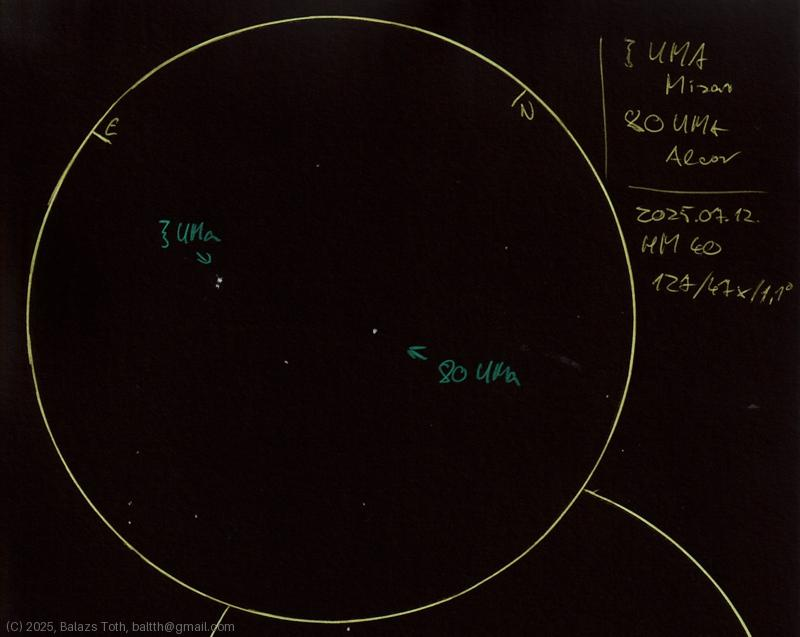

# Zeta Ursae Majoris, 80 Ursae Majoris

[Main page](../index.md) - [Index](../pages/obj_index.md)

_Zeta UMa_ - _ζ UMa_ - _Mizar_ - _Double star in Ursa Major_  
_80 UMa_ - _Alcor_ - _Star in Ursa Major_  

Objects | Zeta Ursae Majoris, 80 Ursae Majoris
-|-
Observed at | Dunaharaszti, HU, 2025-07-12
NELM | ~ 4.0
Aperture | 127 mm
Magnification | 47x
FOV | 1.1 °

Dedicated to my wife.

My ζ 'zeta' looks like a ξ 'xi' here, sorry for that.
I'm sure I'll make another sketch of this trio some day.

## Links

- [Full sketch](../img/zeta-uma-80-uma-kappa-her-20250715.jpg)
- [Original sketch](../scan/20250715_1.jpg)
