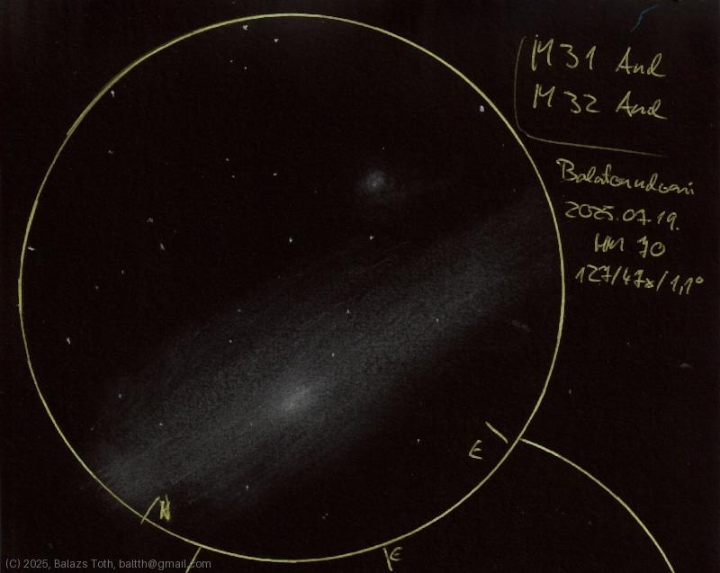

> This site contains some astronomy sketches, created just for fun.
> More info coming soon.
> 
> Balazs Toth - baltth at gmail dot com

---

## Latest

- 2025-08-19: [NGC 6633](obs/ngc-6633-2025-08-19.md)
- 2025-08-19: [Messier 57](obs/m57-2025-08-19.md)
- 2025-08-19: [Messier 27](obs/m27-2025-08-19.md)
- 2025-08-19: [61 Cygni](obs/61-cyg-2025-08-19.md)
- 2025-08-18: [Messier 34](obs/m34-2025-08-18.md)
- 2025-08-18: [Alpha Ursae Minoris](obs/alpha-umi-2025-08-18.md)
- 2025-08-06: [Saturn](obs/saturn-2025-08-06.md)
- 2025-08-06: [Theta Serpentis](obs/theta-ser-2025-08-06.md)
- 2025-08-04: [Eta Cassiopeiae](obs/eta-cas-2025-08-04.md)
- 2025-08-04: [70 Ophiuchi](obs/70-oph-2025-08-04.md)

---

## [All observations](pages/log.md)

## [Index](pages/obj_index.md)

---

## Sketching

Being a low-tech guy, I enjoy using simple tools and methods and
doing everything the analog way. I create sketches on a simple
B5 sketchbook with pencil, scanned and inverted before publishing.
Post processing is minimal, just a small adjustment on the
brightness curve of the image.

When I've done my first sketch into a B5 notebook it was
just a FOV circle on the top of the page.
The template for the circle was a lid of a yoghurt container
because this was the first thing I found with the proper size.
As I take observation notes to a different notebook, there was
a lot of remaining space on the page. This gave me the idea to
draw a second, incomplete FOV for one more sketch.
I liked the result and I've stuck with this style.

> By the way this was [Messier 11](obs/m11-2025-06-27.md),
> the second sketch is the same object with different magnification.

I use different colors during sketching.

- blue pen for FOV and sketch notes,
- red pencil for highlights in the FOV,
- graphite pencils for most of the sketch (2H-3B), and
- a series of color pencils for colored stars and nebulae.
  
I like the idea of drawing with inverted colors but it's challenging
to find the proper ones, especially for yellow stars.
My current setup and the inverted result looks like

The code of lines and points identifies the color by its
approximate RGB spectrum. This is marked on the pencils to
be able to identify in the dark:

> Note that `|||` pencil is grey instead of white. For white color I
> trivially use the ordinary graphite pencils.

...
