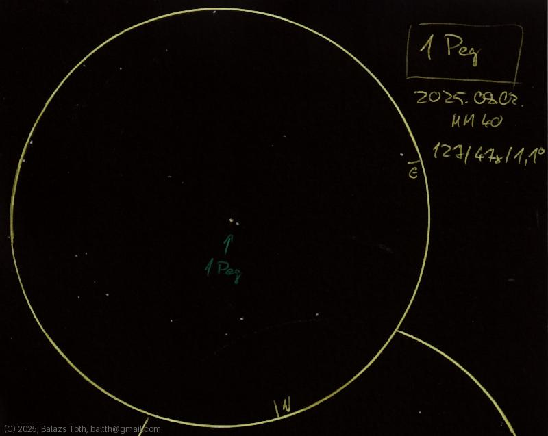

# 1 Pegasi

[Main page](../index.md) - [Index](../pages/obj_index.md)

_1 Peg_ - _Star system in Pegasus_  

Object | 1 Pegasi
-|-
Observed at | Dunaharaszti, HU, 2025-08-02
NELM | ~ 4.0
Aperture | 127 mm
Magnification | 47x
FOV | 1.1 °

## Links

- [Full sketch](../img/1-peg-stf-2841-20250803.jpg)
- [Original sketch](../scan/20250803.jpg)
