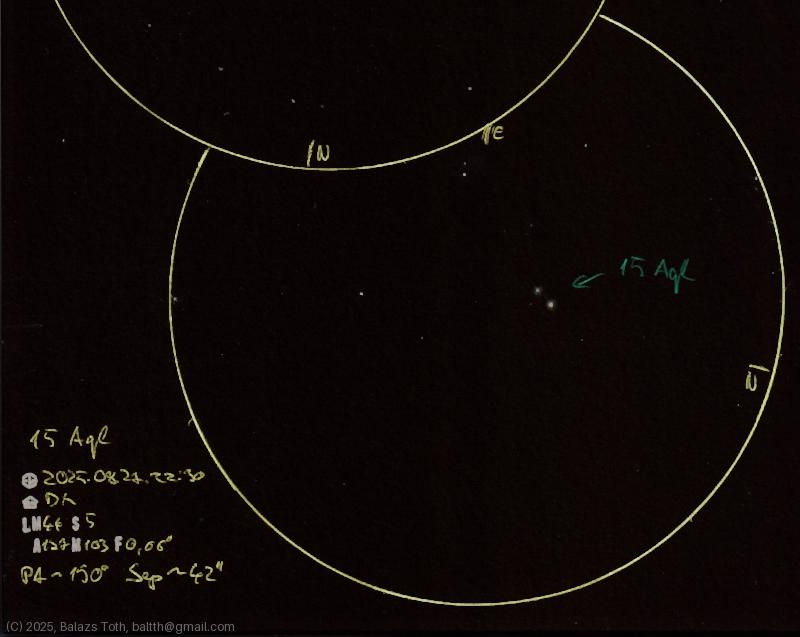

# 15 Aquilae

[Main page](../index.md) -- [Index](../pages/obj_index.md)

_15 Aql_ -- _h Aql_ -- _Double star in Aquila_  

This was the first time I'd measured separation of double stars.
I used no special equipment and done a naive calculation 
just for fun. I may describe the method later, now the results:

_PA: ~150°, separation: 42"_

Not bad for the first try, Wikipedia [mentions](https://en.wikipedia.org/wiki/15_Aquilae)
_39"_ separation.

Object | 15 Aquilae
-|-
Observed at | Dunaharaszti, HU, 2025-08-27 22:30
NELM | ~ 4.4
Seeing | 5
Aperture | 127 mm
Magnification | 103x
FOV | 0.66°
**Other data** |  
PA | ~150°
Separation | 42"

#### Object data

Objects | 15 Aquilae | HD 177442
-|-|-
Fetched as | HD 177463 | 
Desc. | Giant star † | Star †
RA | 19h 04m 57s † | 19h 04m 56s †
Dec | -5° 58' 7" † | -5° 57' 33" †
Magnitude | 5.4 | 7.0
Spectral class | K1III † | K0 †

† fetched from [astronomyapi.com](http://astronomyapi.com)

## Links

- [Full sketch](../img/pi-1-peg-pi-2-peg-15-aql-20250828.jpg)
- [Original sketch](../scan/20250828010814_001.jpg)
