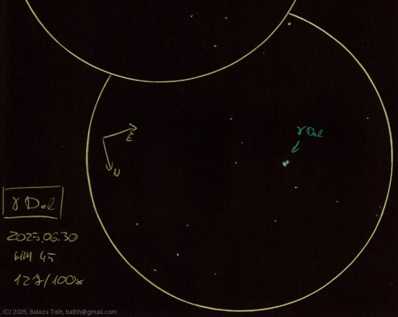

# Gamma Delphini

[Main page](../../index.md) -- [Index](../../pages/obj_index.md) -- [Next: Gamma Delphini on 2026-09-08](../../obs/2026/gamma-del-2026-09-08.md)

_Gamma Del_ -- _γ Del_ -- _Double star in Delphinus_  

Object | Gamma Delphini
-|-
Observed at | Dunaharaszti, HU, 2025-06-30
NELM | ~ 4.5
Aperture | 127 mm
Magnification | 100x
FOV | 0.68°

## Links

- [Full sketch](../../img/2025/m15-gamma-del-20250701.jpg)
- [Original sketch](../../scan/2025/20250701092405_002.jpg)
- [Next: Gamma Delphini on 2026-09-08](../../obs/2026/gamma-del-2026-09-08.md)
