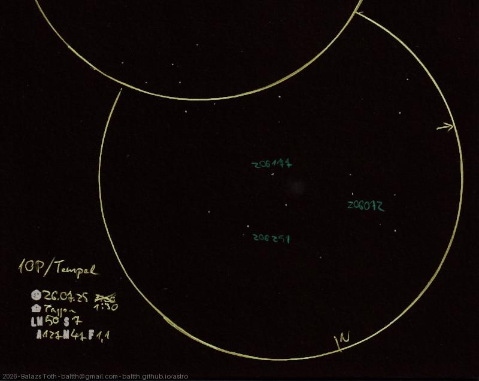

# 10P/Tempel

[Main page](../../index.md) -- [Index](../../pages/obj_index.md)

_Tempel 2_ -- _Comet in Solar System_  

Can you see it? It's between _HD 206177_ and _HD 206072._
It was hard to find and observe. I had a short time between the clouds and it also had
a relatively low elevation. So faint, I saw no trail nor any color. Its distance was
~ 0.45 AU, the apparent magnitude was ~9.

> Maybe this is too realistic, I should have drawn it brighter to be seen...

Object | 10P/Tempel
-|-
Observed at | Szent Balázs-hegy, Szentantalfa, HU, 2026-07-25 01:30
NELM | ~ 5.0
Seeing | 7
Aperture | 127 mm
Magnification | 47x
FOV | 1.1°

> I really like this place. A beautiful rural sky, perfect view to the South, and only a few lights from _Balaton._
> Unfortunately this night was disturbed by some clouds and moonshine.
> 
> Note that the location on the sketch is _Tagyon._ That's incorrect, the mountain belongs to _Szentantalfa._

## Links

- [Full sketch](../../img/m17-10p-tempel-20260804.jpg)
- [Original sketch](../../scan/20260804000507_001.jpg)
