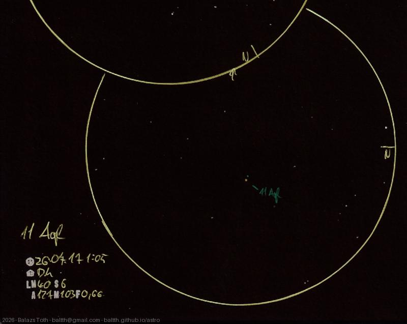

# 11 Aquilae

[Main page](../../index.md) -- [Index](../../pages/obj_index.md)

_11 Aql_ -- _STF 2424 AB_ -- _Double star in Aquila_  

A visual triple star system _(STF 2424)._ For me it was double, C component has visual magnitude of 13.4 ...

Object | 11 Aquilae
-|-
Observed at | Dunaharaszti, HU, 2026-07-17 01:05
NELM | ~ 4.0
Seeing | 6
Aperture | 127 mm
Magnification | 103x
FOV | 0.66°

#### Object data

Objects | 11 Aql A | 11 Aql B
-|-|-
Fetched as | HD 176303 | 
Desc. | Main sequence main sequence star † | 
RA | 18h 59m 05s † | 
Dec | 13° 37' 20" † | 
Magnitude | 5.2 | 9.3
Spectral class | F8V † | F6IV

† fetched from [astronomyapi.com](http://astronomyapi.com)

## Links

- [Full sketch](../../img/2026/m25-11-aql-20260804.jpg)
- [Original sketch](../../scan/2026/20260804000152_001.jpg)
