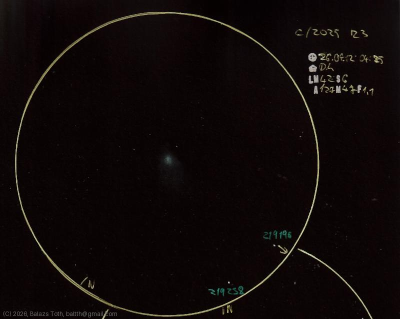

# C/2025 R3

[Main page](../../index.md) -- [Index](../../pages/obj_index.md)

_C/2025 R3_ -- _Comet in Solar System_  

I've observed this comet from home. It was hard to find an acceptable observation position,
there's no good view to the east and what I have is full of city lights. It was hard to see even
in the finder. Still it was worth to see, especially as it's not going to return.

Object | C/2025 R3
-|-
Observed at | Dunaharaszti, HU, 2026-04-12 04:25
NELM | ~ 4.2
Seeing | 6
Aperture | 127 mm
Magnification | 47x
FOV | 1.1°

## Links

- [Full sketch](../../img/c-2025-r3-m57-20260420.jpg)
- [Original sketch](../../scan/20260420213347_001.jpg)
