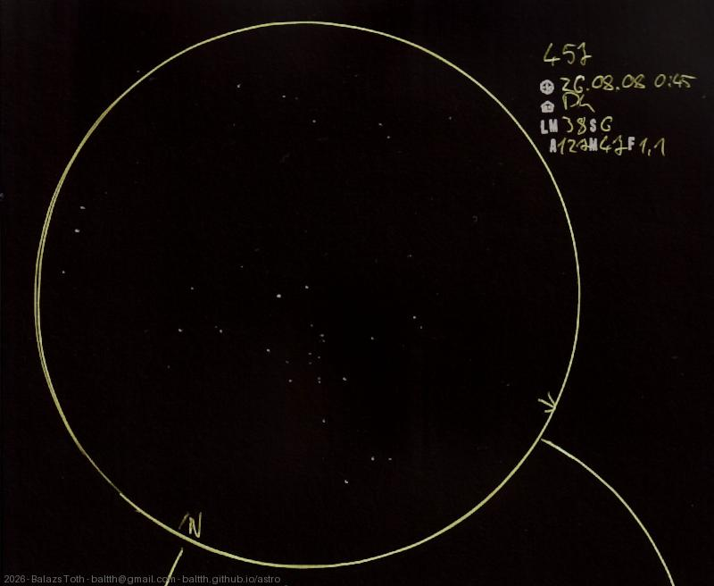

# C13

[Main page](../../index.md) -- [Index](../../pages/obj_index.md)

_Owl Cluster_ -- _Dragonfly Cluster_ -- _NGC 457_ -- _Open cluster in Cassiopeia_  

I've been waiting for this for a time. The sky was not ideal, I've seen this better
several times. Let's say this was a practice session.

Object | C13
-|-
Observed at | Dunaharaszti, HU, 2026-08-08 00:45
NELM | ~ 3.8
Seeing | 6
Aperture | 127 mm
Magnification | 47x
FOV | 1.1°

#### Object data

Object | NGC 457
-|-
Desc. | Very low disperation, large sized cluster with rich star density †
RA | 01h 19m 32s †
Dec | 58° 17' 27" †

† fetched from [astronomyapi.com](http://astronomyapi.com)

## Links

- [Full sketch](../../img/2026/c13-saturn-20260813.jpg)
- [Original sketch](../../scan/2026/20260813073147_001.jpg)
