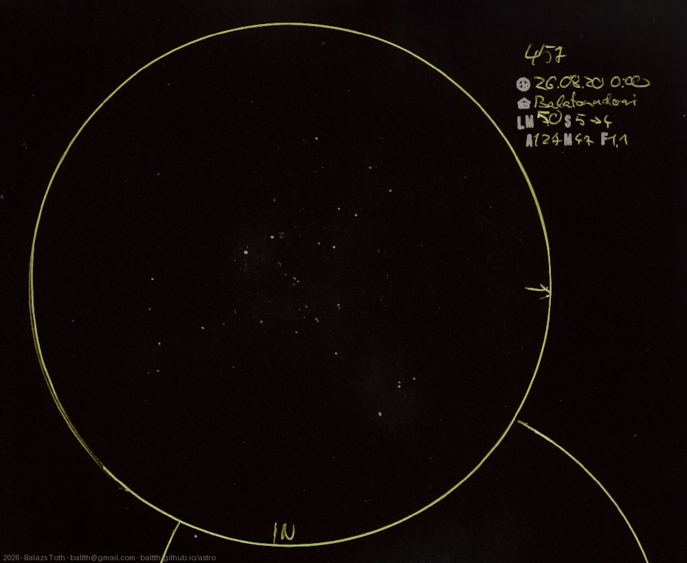

# C13

[Main page](../../index.md) -- [Index](../../pages/obj_index.md) -- [Previous: C13 on 2026-08-07](../../obs/2026/c13-2026-08-07.md)

_Owl Cluster_ -- _Dragonfly Cluster_ -- _NGC 457_ -- _Open cluster in Cassiopeia_  

Twelve days after the [previous sketch](c13-2026-08-07.md)
I've made this as a comparison - much less light pollution, but the seeing is worse.
I'm not satisfied with the shape of the owl - maybe next time.

Object | C13
-|-
Observed at | Balatonudvari, HU, 2026-08-20 00:00
NELM | ~ 5.0
Seeing | 5, then 4
Aperture | 127 mm
Magnification | 47x
FOV | 1.1°

> Good skies but no good view. I was sitting in garden with a single dark place,
> viewing only Cassiopeia, Andromeda and their close neighborhood.

#### Object data

Object | NGC 457
-|-
Desc. | Very low disperation, large sized cluster with rich star density †
RA | 01h 19m 32s †
Dec | 58° 17' 27" †

† fetched from [astronomyapi.com](http://astronomyapi.com)

## Links

- [Full sketch](../../img/2026/c13-ngc-281-ic-1590-20260907.jpg)
- [Original sketch](../../scan/2026/20260907003841_001.jpg)
- [Previous: C13 on 2026-08-07](../../obs/2026/c13-2026-08-07.md)
