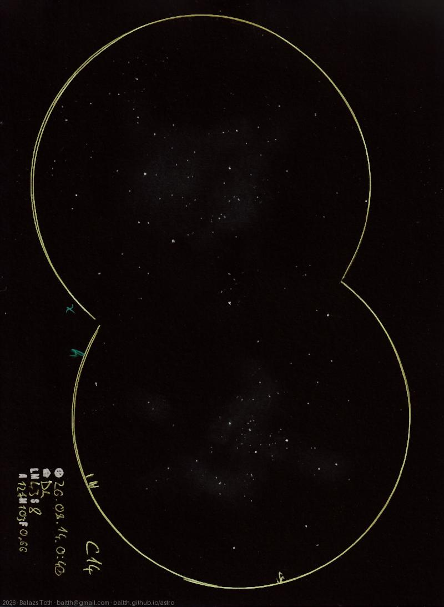

# C14

[Main page](../../index.md) -- [Index](../../pages/obj_index.md)

_χ - h Per_ -- _chi - h Persei_ -- _Double Cluster_ -- _Open clusters in Perseus_  

> This is my second sketch with double FOV - the first was the [Pleiades](../2025/m45-2025-11-01.md) last year.
> I've prepared to do it for some time but never felt be prepared until now.

C14 is the name of the cluster pair _chi Persei_ and _h Persei_, one of the 'all stars' for me.
The conditions were better than usual. It took ~50 minutes to sketch, I assume this would be much higher
if it were done at lower NELM. Unfortunately the clusters are a bit misaligned,
but still I'm pleased with the result.

Object | C14
-|-
Observed at | Dunaharaszti, HU, 2026-08-14 00:40
NELM | ~ 4.3
Seeing | 8
Aperture | 127 mm
Magnification | 103x
FOV | 0.66°

> FOV data represents a single circle, the maximum width is ~1.9°.

#### Object data

Objects | χ Persei | h Persei
-|-|-
Fetched as | NGC 884 | NGC 869
Desc. | Very low disperation, large sized cluster with rich star density † | Very low disperation, large sized cluster with rich star density †
RA | 02h 22m 32s † | 02h 19m 03s †
Dec | 57° 8' 39" † | 57° 8' 6" †

† fetched from [astronomyapi.com](http://astronomyapi.com)

## Links

- [Full sketch](../../img/2026/c14-na-20260814.jpg)
- [Original sketch](../../scan/2026/20260814080955_001.jpg)
