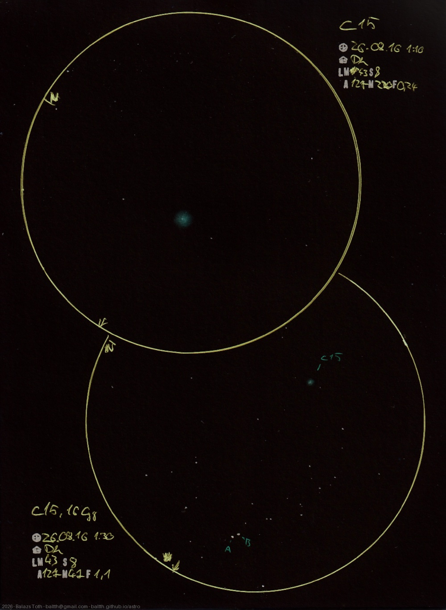

# C15, 16 Cygni

[Main page](../../index.md) -- [Index](../../pages/obj_index.md)

_NGC 6826_ -- _Blinking Planetary Nebula_ -- _Planetary nebula in Cygnus_  
_16 Cyg_ -- _Triple star system in Cygnus_  

The recent hot and dry weather is terrible but at least good for observations. The _Blinking_ was not blinking
but it could be clearly seen even with direct view.

The second sketch shows its neighborhood _(47x, FOV 1.1°)_ with the triple system _16 Cyg._
This has an invisible red dwarf as _C_ component and also an exoplanet at _B._

Objects | C15, 16 Cygni
-|-
Observed at | Dunaharaszti, HU, 2026-08-16 01:10
NELM | ~ 4.3
Seeing | 8
Aperture | 127 mm
Magnification | 220x
FOV | 0.24°

> It's hard to work with inverted green. I see nothing of what's drawn at red light,
> thus the result is too intensive, just like at [Saturn Nebula](../2025/c55-2025-06-30.md).

#### Object data

Objects | NGC 6826 | 16 Cyg A | 16 Cyg B
-|-|-|-
Fetched as |  | HD 186408 | HD 186427
Desc. | Planetary nebula † | Yellow main sequence star † | Yellow main sequence star †
RA | 19h 44m 48s † | 19h 41m 49s † | 19h 41m 52s †
Dec | 50° 31' 31" † | 50° 31' 30" † | 50° 31' 3" †
Magnitude |  | 5.96 | 6.2
Spectral class |  | G2V † | G5V †

† fetched from [astronomyapi.com](http://astronomyapi.com)

## Links

- [Full sketch](../../img/2026/c15-16-cyg-na-20260817.jpg)
- [Original sketch](../../scan/2026/20260817000812_001.jpg)
