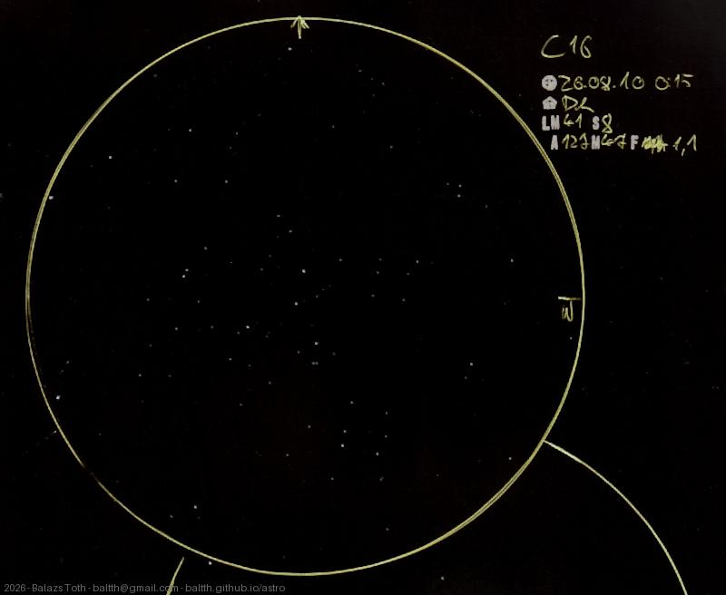

# C16

[Main page](../../index.md) -- [Index](../../pages/obj_index.md)

_NGC 7243_ -- _Open cluster in Lacerta_  

This night was a bit better than usual.
Viewed on a suburban sky, this cluster is really nice and 'rich', having a good contrast with its
surroundings. Maybe it seems average from a better location, but I have no comparison.

Object | C16
-|-
Observed at | Dunaharaszti, HU, 2026-08-10 00:15
NELM | ~ 4.1
Seeing | 8
Aperture | 127 mm
Magnification | 47x
FOV | 1.1°

#### Object data

Object | NGC 7243
-|-
Desc. | High disperation, medium sized cluster with poor star density †
RA | 22h 15m 08s †
Dec | 49° 53' 51" †

† fetched from [astronomyapi.com](http://astronomyapi.com)

## Links

- [Full sketch](../../img/2026/c16-ngc-281-ic-1590-20260813.jpg)
- [Original sketch](../../scan/2026/20260813073737_001.jpg)
