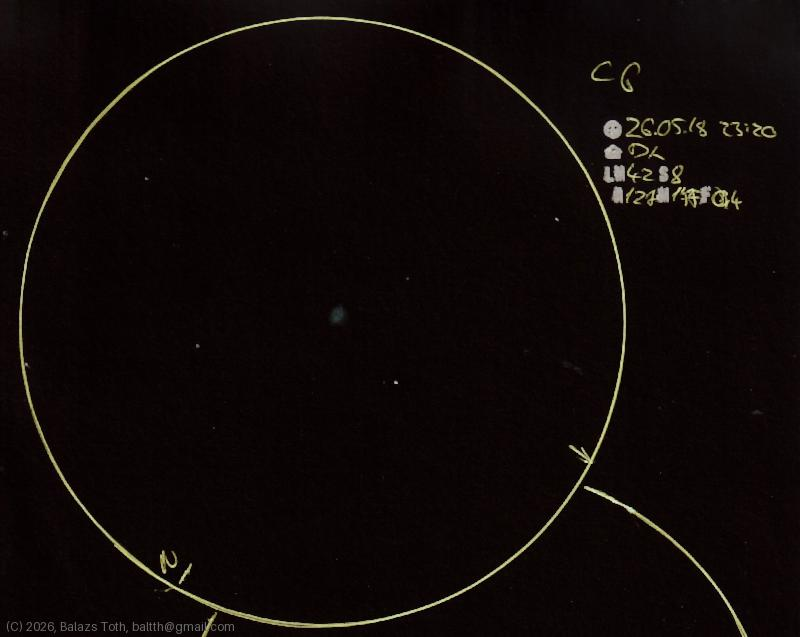

# C6

[Main page](../../index.md) -- [Index](../../pages/obj_index.md)

_Cat's Eye Nebula_ -- _NGC 6543_ -- _Planetary nebula in Draco_  

Object | C6
-|-
Observed at | Dunaharaszti, HU, 2026-05-18 23:20
NELM | ~ 4.2
Seeing | 8
Aperture | 127 mm
Magnification | 171x
FOV | 0.4°

#### Object data

Object | NGC 6543
-|-
Desc. | Planetary nebula †
RA | 17h 58m 33s †
Dec | 66° 37' 59" †

† fetched from [astronomyapi.com](http://astronomyapi.com)

## Links

- [Full sketch](../../img/c6-nu-dra-20260601.jpg)
- [Original sketch](../../scan/20260601011428_001.jpg)
