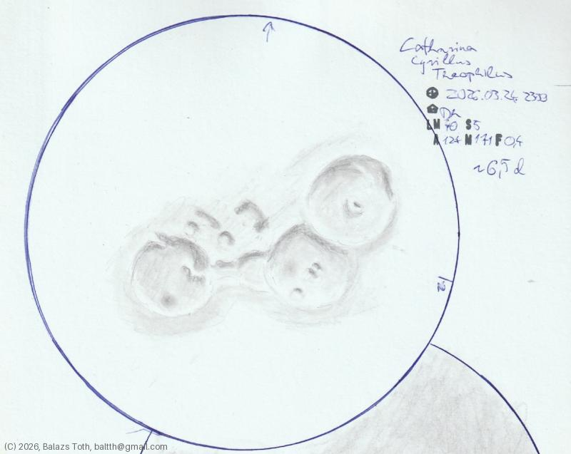

# Catharina, Cyrillus, Theophilus

[Main page](../../index.md) -- [Index](../../pages/obj_index.md)

_Catharina_ -- _Crater in Moon_  
_Cyrillus_ -- _Crater in Moon_  
_Theophilus_ -- _Crater in Moon_  

Objects | Catharina, Cyrillus, Theophilus
-|-
Observed at | Dunaharaszti, HU, 2026-03-24 23:00
NELM | ~ 4.0
Seeing | 5
Aperture | 127 mm
Magnification | 171x
**Other data** |  
Age of Moon | 6.5 days

> These sketches are incomplete, I had to stop drawing due to the clouds.

#### Object data

Objects | Catharina | Cyrillus | Theophilus
-|-|-|-
Desc. | Crater | Crater | Crater
Coordinates | 18.0°S 23.6°E | 13.2°S 24.0°E | 11.4°S 26.4°E
Size | 100 km | 98 km | 100 km

## Links

- [Full sketch](../../img/catharina-cyrillus-theophilus-langrenus-20260420.jpg)
- [Original sketch](../../scan/20260420213028_001.jpg)
