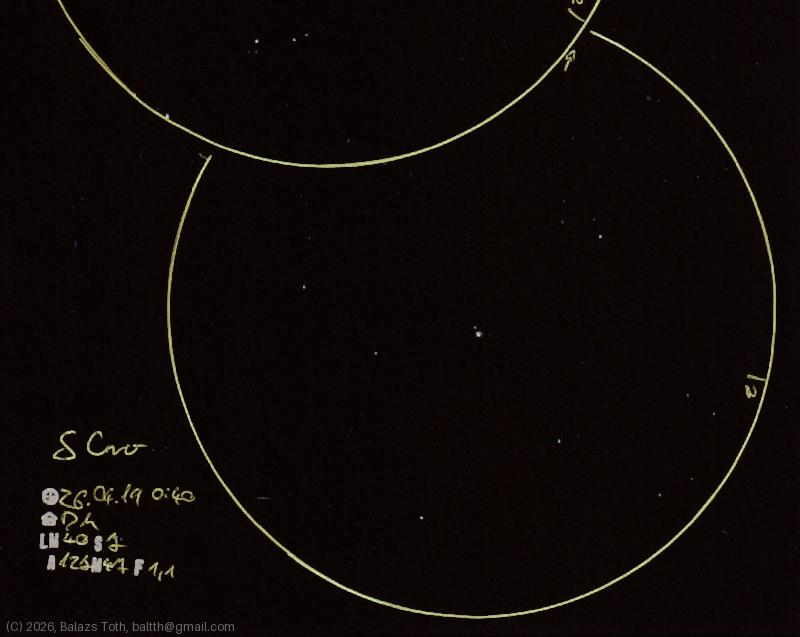

# Delta Corvi

[Main page](../../index.md) -- [Index](../../pages/obj_index.md)

_Delta Crv_ -- _δ Crv_ -- _Algorab_ -- _Double star in Corvus_  

Object | Delta Corvi
-|-
Observed at | Dunaharaszti, HU, 2026-04-19 00:40
NELM | ~ 4.0
Seeing | 7
Aperture | 127 mm
Magnification | 47x
FOV | 1.1°

#### Object data

Objects | Delta Crv A | Delta Crv B
-|-|-
Fetched as | HD 108767 | HR 4757
Desc. | Blue star † | 
RA | 12h 29m 51s † | 
Dec | -17° 29' 4" † | 
Magnitude | 2.96 | 9.3
Spectral class | B9.5V † | K2Ve

† fetched from [astronomyapi.com](http://astronomyapi.com)

## Links

- [Full sketch](../../img/m104-delta-crv-20260529.jpg)
- [Original sketch](../../scan/20260420213733_001.jpg)
