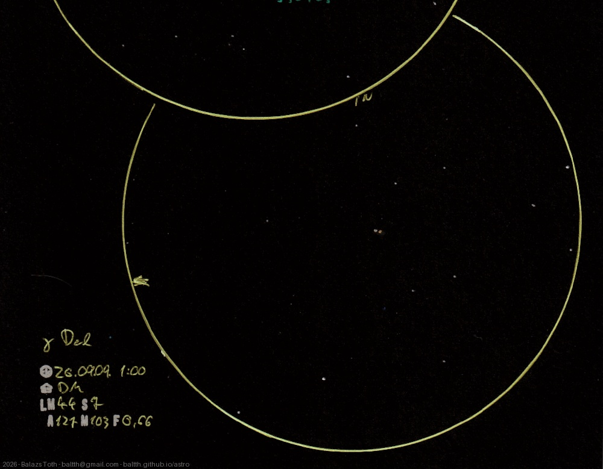

# Gamma Delphini

[Main page](../../index.md) -- [Index](../../pages/obj_index.md) -- [Previous: Gamma Delphini on 2025-06-30](../../obs/2025/gamma-del-2025-06-30.md)

_Gamma Del_ -- _γ Del_ -- _Double star in Delphinus_  

Object | Gamma Delphini
-|-
Observed at | Dunaharaszti, HU, 2026-09-09 01:00
NELM | ~ 44
Seeing | 7
Aperture | 127 mm
Magnification | 103x
FOV | 0.66°

## Links

- [Full sketch](../../img/2026/v488-sge-gamma-del-20260928.jpg)
- [Original sketch](../../scan/2026/20260919015257_001.jpg)
- [Previous: Gamma Delphini on 2025-06-30](../../obs/2025/gamma-del-2025-06-30.md)
