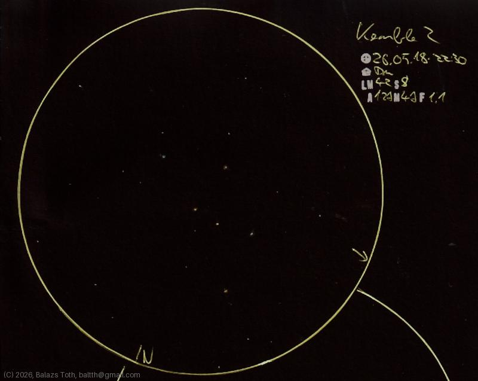

# Kemble 2

[Main page](../../index.md) -- [Index](../../pages/obj_index.md)

_Mini-Cassiopeia_ -- _Little Queen_ -- _Asterism in Draco_  

Object | Kemble 2
-|-
Observed at | Dunaharaszti, HU, 2026-05-18 22:30
NELM | ~ 4.2
Seeing | 8
Aperture | 127 mm
Magnification | 47x
FOV | 1.1°

#### Object data

Object | Kemble 2
-|-
Desc. | Asterism
RA | 18h 34m 54s
Dec | 72° 23' 2"

## Links

- [Full sketch](../../img/2026/kemble-2-psi-1-dra-20260601.jpg)
- [Original sketch](../../scan/2026/20260601011218_001.jpg)
