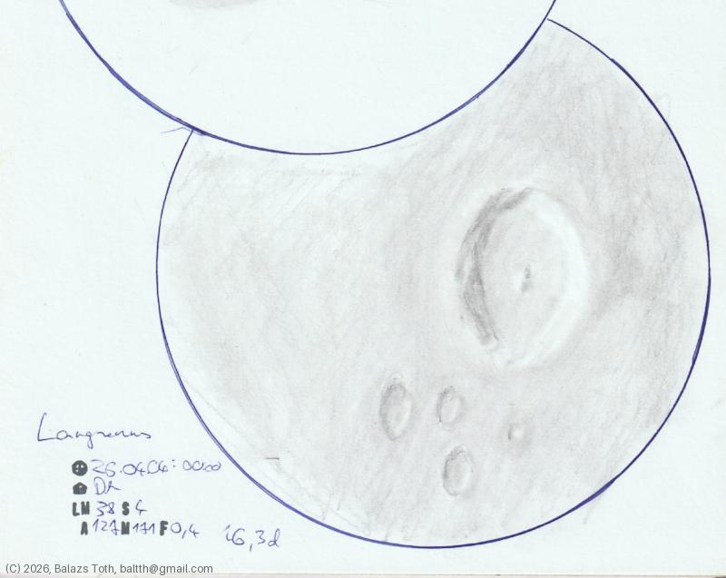

# Langrenus

[Main page](../../index.md) -- [Index](../../pages/obj_index.md)

_Langrenus_ -- _Crater in Moon_  

Object | Langrenus
-|-
Observed at | Dunaharaszti, HU, 2026-04-04 00:00
NELM | ~ 3.8
Seeing | 4
Aperture | 127 mm
Magnification | 171x
**Other data** |  
Age of Moon | 16.3 days

> These sketches are incomplete, I had to stop drawing due to the clouds.

#### Object data

Object | Langrenus
-|-
Desc. | Crater
Coordinates | 8.9°S 60.9°E
Size | 132 km

## Links

- [Full sketch](../../img/2026/catharina-cyrillus-theophilus-langrenus-20260420.jpg)
- [Original sketch](../../scan/2026/20260420213028_001.jpg)
