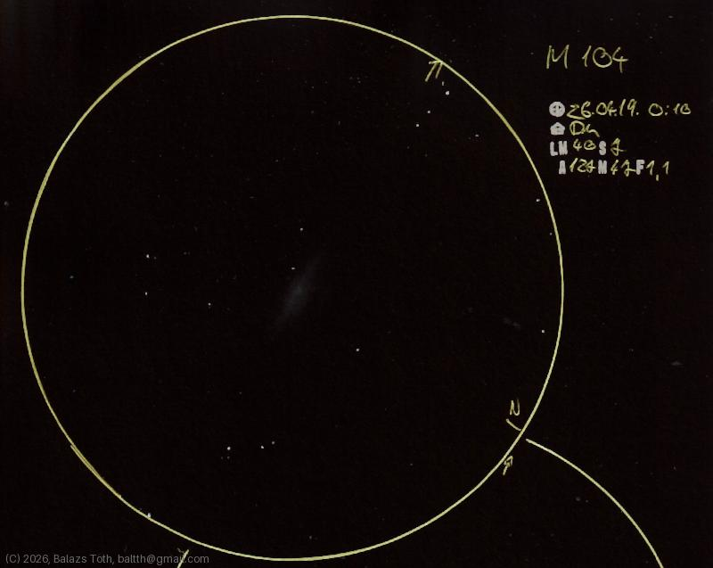

# Messier 104

[Main page](../../index.md) -- [Index](../../pages/obj_index.md)

_M104_ -- _NGC 4594_ -- _Sombrero Galaxy_ -- _Galaxy in Virgo_  

Object | Messier 104
-|-
Observed at | Dunaharaszti, HU, 2026-04-19 00:10
NELM | ~ 4.0
Seeing | 7
Aperture | 127 mm
Magnification | 47x
FOV | 1.1°

#### Object data

Object | M 104
-|-
Desc. | Spiral galaxy †
RA | 12h 40m 12s †
Dec | -11° 37' 12" †

† fetched from [astronomyapi.com](http://astronomyapi.com)

## Links

- [Full sketch](../../img/m104-delta-crv-20260529.jpg)
- [Original sketch](../../scan/20260420213733_001.jpg)
