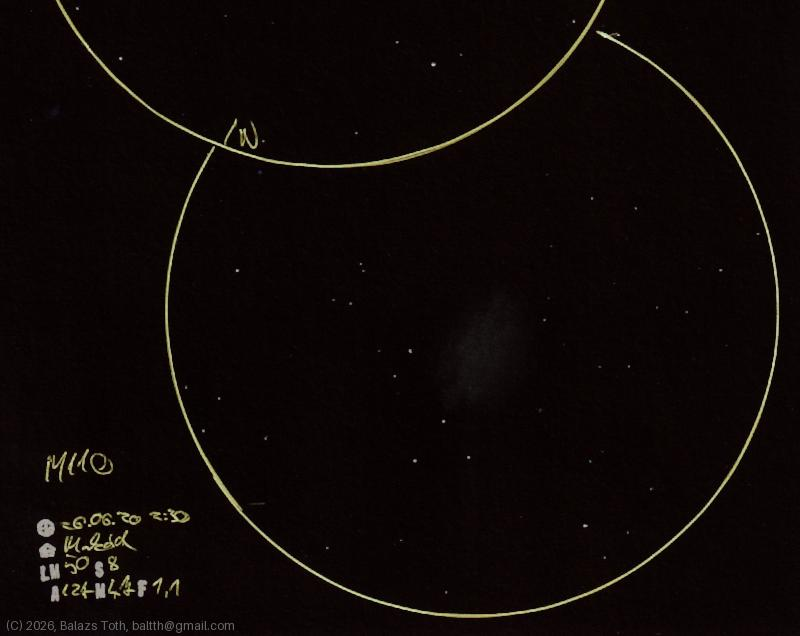

# Messier 110

[Main page](../../index.md) -- [Index](../../pages/obj_index.md)

_M110_ -- _Andromeda Satellite #2_ -- _NGC 205_ -- _Galaxy in Andromeda_  

This galaxy is hard to see, mainly because it lies on the boundary of
[Androameda galaxy](m31-m32-2025-07-19.md). If you don't see it, that's not your fault...

Object | Messier 110
-|-
Observed at | Rózsa-sziget, Makád, HU, 2026-06-20 02:30
NELM | ~ 50
Seeing | 8
Aperture | 127 mm
Magnification | 47x
FOV | 1.1°

#### Object data

Object | M 110
-|-
Desc. | Elliptical galaxy †
RA | 00h 40m 12s †
Dec | 41° 41' 24" †

† fetched from [astronomyapi.com](http://astronomyapi.com)

## Links

- [Full sketch](../../img/m52-m110-20260709.jpg)
- [Original sketch](../../scan/20260709011046_001.jpg)
