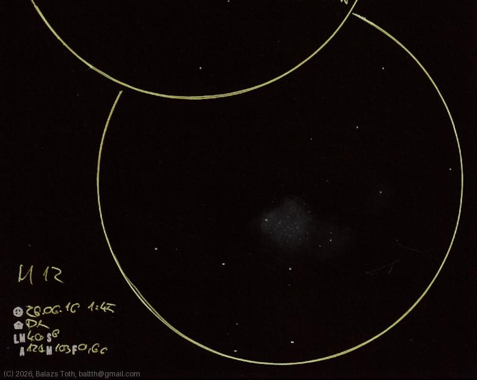

# Messier 12

[Main page](../../index.md) -- [Index](../../pages/obj_index.md)

_M12_ -- _NGC 6218_ -- _Gumball Globular Cluster_ -- _Globular cluster in Ophiuchus_  

I usually struggle observing [M10](m10-2026-06-15.md) and M12 from the suburban sky of my hometown -
somehow they're hard to locate and not spectacular. This night was different.

M12 has an asymmetric shape and no definite center. I was able to resolve several
stars. Overall it looks really nice.

Object | Messier 12
-|-
Observed at | Dunaharaszti, HU, 2026-06-16 01:45
NELM | ~ 4.0
Seeing | 6
Aperture | 127 mm
Magnification | 103x
FOV | 0.66°

#### Object data

Object | M 12
-|-
Desc. | Globular cluster
RA | 16h 47m 24s †
Dec | -1° 57' 0" †

† fetched from [astronomyapi.com](http://astronomyapi.com)

## Links

- [Full sketch](../../img/m10-m12-20260709.jpg)
- [Original sketch](../../scan/20260709010839_001.jpg)
