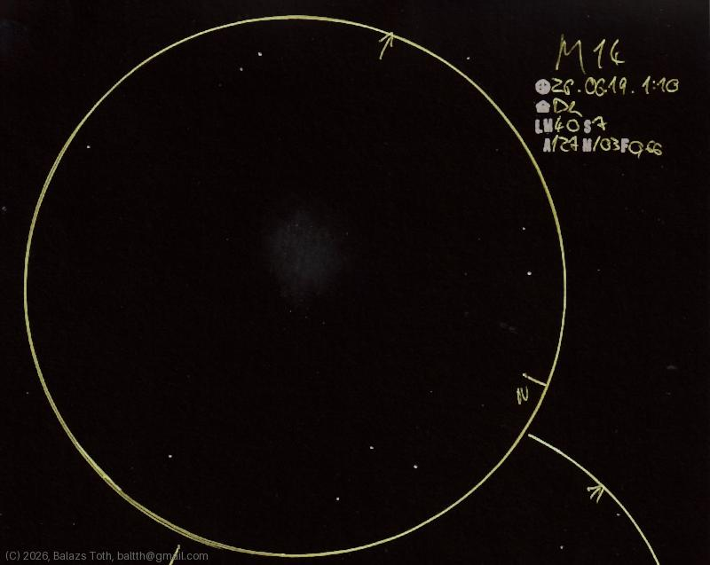

# Messier 14

[Main page](../../index.md) -- [Index](../../pages/obj_index.md)

_M14_ -- _NGC 6402_ -- _Globular cluster in Ophiuchus_  

Object | Messier 14
-|-
Observed at | Dunaharaszti, HU, 2026-06-19 01:10
NELM | ~ 40
Seeing | 7
Aperture | 127 mm
Magnification | 103x
FOV | 0.66°

#### Object data

Object | M 14
-|-
Desc. | Rather loosely concentrated towards the center globular cluster †
RA | 17h 37m 48s †
Dec | -3° 15' 0" †

† fetched from [astronomyapi.com](http://astronomyapi.com)

## Links

- [Full sketch](../../img/m14-m16-20260709.jpg)
- [Original sketch](../../scan/20260709010949_001.jpg)
