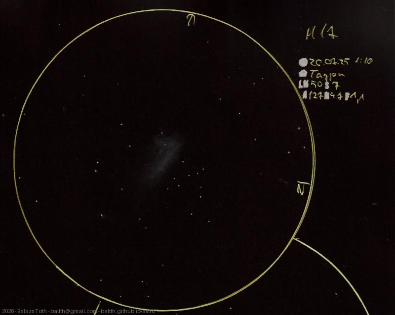

# Messier 17

[Main page](../../index.md) -- [Index](../../pages/obj_index.md)

_M17_ -- _NGC 6618_ -- _Omega Nebula_ -- _Swan Nebula_ -- _Horseshoe Nebula_ -- _Super nova remnant in Serpens_  

Well, this was not the best view of this nebula, but still worth to see. Maybe next time...

Object | Messier 17
-|-
Observed at | Szent Balázs-hegy, Szentantalfa, HU, 2026-07-25 01:10
NELM | ~ 5.0
Seeing | 7
Aperture | 127 mm
Magnification | 47x
FOV | 1.1°

> I really like this place. A beautiful rural sky, perfect view to the South, and only a few lights from _Balaton._
> Unfortunately this night was disturbed by some clouds and moonshine.
> 
> Note that the location on the sketch is _Tagyon._ That's incorrect, the mountain belongs to _Szentantalfa._

#### Object data

Object | M 17
-|-
Desc. | Super nova remnant †
RA | 18h 20m 24s †
Dec | -16° 10' 48" †

† fetched from [astronomyapi.com](http://astronomyapi.com)

## Links

- [Full sketch](../../img/m17-10p-tempel-20260804.jpg)
- [Original sketch](../../scan/20260804000507_001.jpg)
