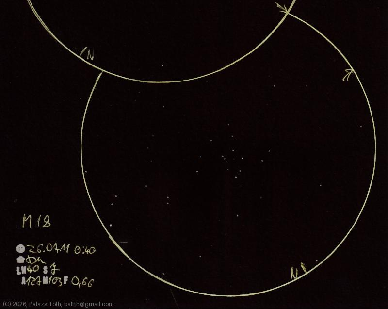

# Messier 18

[Main page](../../index.md) -- [Index](../../pages/obj_index.md)

_M18_ -- _NGC 6613_ -- _Black Swan Cluster_ -- _Open cluster in Sagittarius_  

I assume this looks much better from a better location. Still it's worth to see and enjoyable to draw.

Object | Messier 18
-|-
Observed at | Dunaharaszti, HU, 2026-07-11 00:40
NELM | ~ 4.0
Seeing | 7
Aperture | 127 mm
Magnification | 103x
FOV | 0.66°

#### Object data

Object | M 18
-|-
Desc. | Low disperation, large sized cluster with poor star density †
RA | 18h 19m 12s †
Dec | -17° 7' 48" †

† fetched from [astronomyapi.com](http://astronomyapi.com)

## Links

- [Full sketch](../../img/mars-uranus-m18-20260804.jpg)
- [Original sketch](../../scan/20260804000051_001.jpg)
