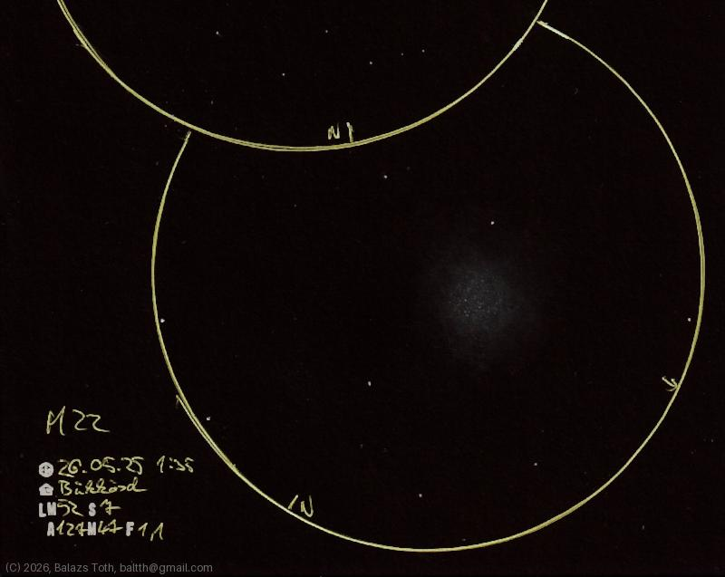

# Messier 22

[Main page](../../index.md) -- [Index](../../pages/obj_index.md)

_M22_ -- _NGC 6656_ -- _Great Sagittarius Cluster_ -- _Globular cluster in Sagittarius_  

Object | Messier 22
-|-
Observed at | Bükkösd, HU, 2026-05-25 01:35
NELM | ~ 52
Seeing | 7
Aperture | 127 mm
Magnification | 47x
FOV | 1.1°

#### Object data

Object | M 22
-|-
Desc. | Intermediate loose concentration globular cluster †
RA | 18h 36m 36s †
Dec | -23° 54' 0" †

† fetched from [astronomyapi.com](http://astronomyapi.com)

## Links

- [Full sketch](../../img/m8-m22-20260601.jpg)
- [Original sketch](../../scan/20260601011525_001.jpg)
