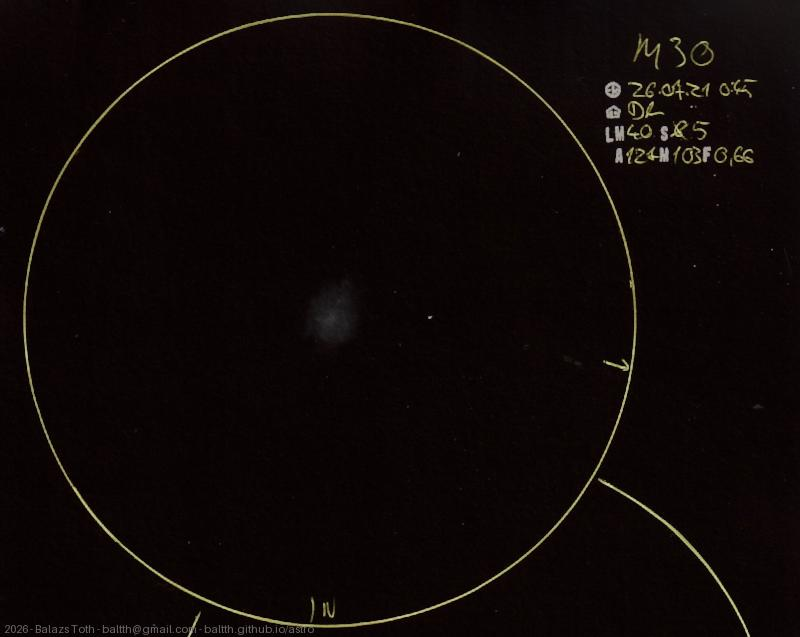

# Messier 30

[Main page](../../index.md) -- [Index](../../pages/obj_index.md)

_M30_ -- _NGC 7099_ -- _Jellyfish Cluster_ -- _Globular cluster in Capricornus_  

Object | Messier 30
-|-
Observed at | Dunaharaszti, HU, 2026-07-21 00:45
NELM | ~ 4.0
Seeing | 5
Aperture | 127 mm
Magnification | 103x
FOV | 0.66°

#### Object data

Object | M 30
-|-
Desc. | Intermediate concentrations globular cluster †
RA | 21h 40m 12s †
Dec | -23° 10' 48" †

† fetched from [astronomyapi.com](http://astronomyapi.com)

## Links

- [Full sketch](../../img/2026/m30-zeta-aqr-20260804.jpg)
- [Original sketch](../../scan/2026/20260804000314_001.jpg)
