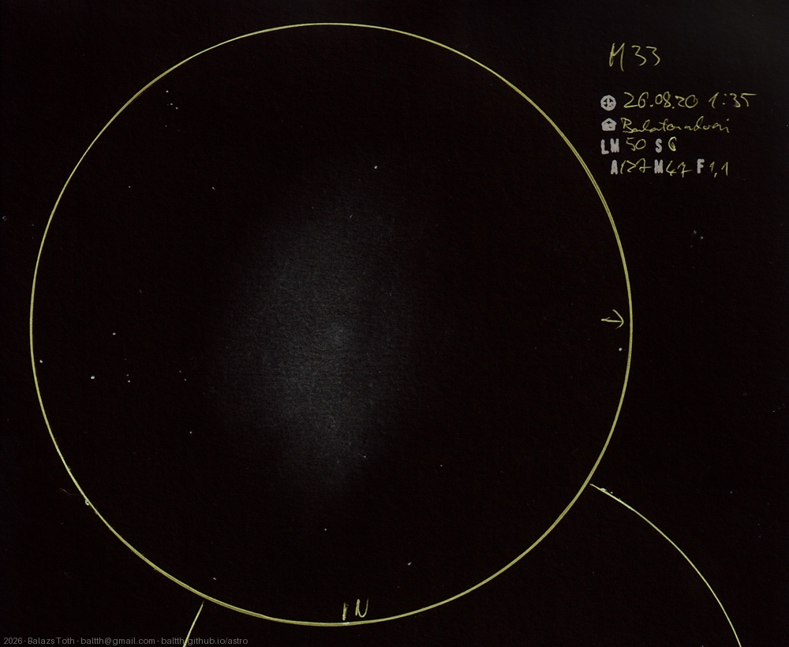

# Messier 33

[Main page](../../index.md) -- [Index](../../pages/obj_index.md)

_M33_ -- _NGC 598_ -- _Triangulum Galaxy_ -- _Galaxy in Triangulum_  

The first time I saw this like it's worth to sketch. It was definitely asymmetric,
being flat (or faint) on the East side.

Object | Messier 33
-|-
Observed at | Balatonudvari, HU, 2026-08-20 01:35
NELM | ~ 5.0
Seeing | 6
Aperture | 127 mm
Magnification | 47x
FOV | 1.1°

#### Object data

Object | M 33
-|-
Desc. | Dwarf spiral galaxy †
RA | 01h 33m 36s †
Dec | 30° 39' 36" †

† fetched from [astronomyapi.com](http://astronomyapi.com)

## Links

- [Full sketch](../../img/2026/m33-m76-20260908.jpg)
- [Original sketch](../../scan/2026/20260907004004_001.jpg)
