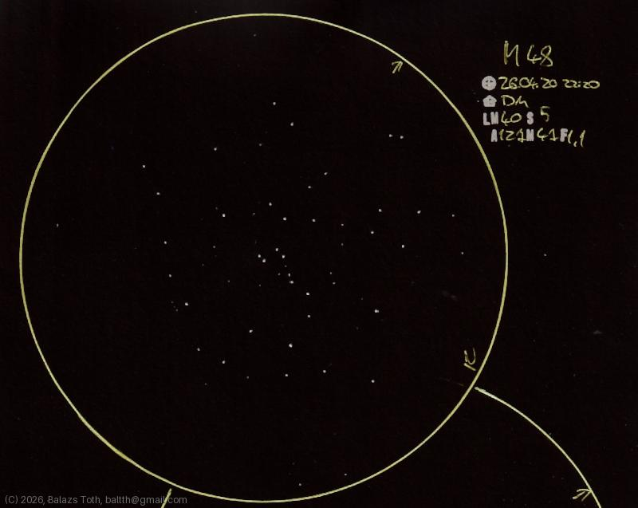

# Messier 48

[Main page](../../index.md) -- [Index](../../pages/obj_index.md)

_M48_ -- _Open cluster in Hydra_  

Bad conditions for observation and a pretty open cluster.

Object | Messier 48
-|-
Observed at | Dunaharaszti, HU, 2026-04-20 22:20
NELM | ~ 4.0
Seeing | 5
Aperture | 127 mm
Magnification | 4.7x
FOV | 1.1°

#### Object data

Object | M 48
-|-
Desc. | Very low disperation, medium sized cluster with medium star density †
RA | 08h 13m 12s †
Dec | -5° 45' 0" †

† fetched from [astronomyapi.com](http://astronomyapi.com)

## Links

- [Full sketch](../../img/2026/m48-m92-20260601.jpg)
- [Original sketch](../../scan/2026/20260601011330_001.jpg)
