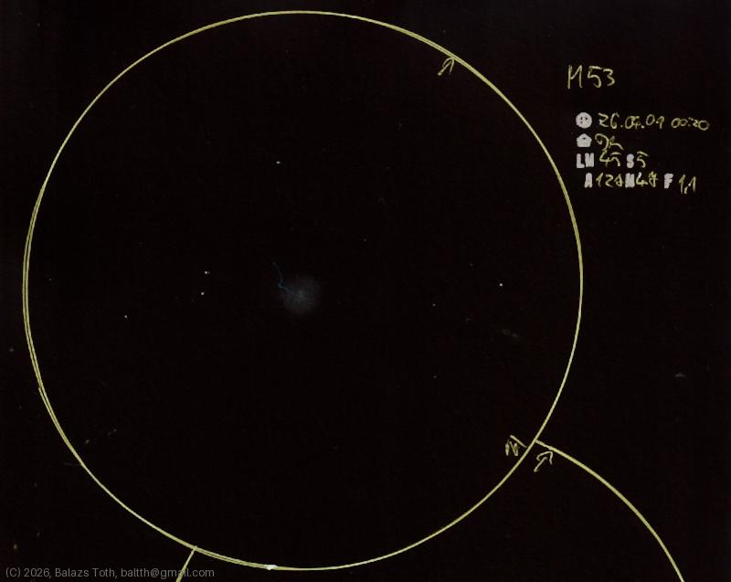

# Messier 53

[Main page](../../index.md) -- [Index](../../pages/obj_index.md)

_M53_ -- _NGC 5024_ -- _Globular cluster in Coma Berenices_  

Nice and shiny cluster with a strange alien worm visitor... No, that blue line is the art of my younger daughter.

Object | Messier 53
-|-
Observed at | Dunaharaszti, HU, 2026-04-09 00:20
NELM | ~ 4.5
Seeing | 5
Aperture | 127 mm
Magnification | 47x
FOV | 1.1°

#### Object data

Object | M 53
-|-
Desc. | Intermediate concentrations globular cluster †
RA | 13h 13m 12s †
Dec | 18° 10' 12" †

† fetched from [astronomyapi.com](http://astronomyapi.com)

## Links

- [Full sketch](../../img/m53-m64-20260410.jpg)
- [Original sketch](../../scan/20260410170920_001.jpg)
