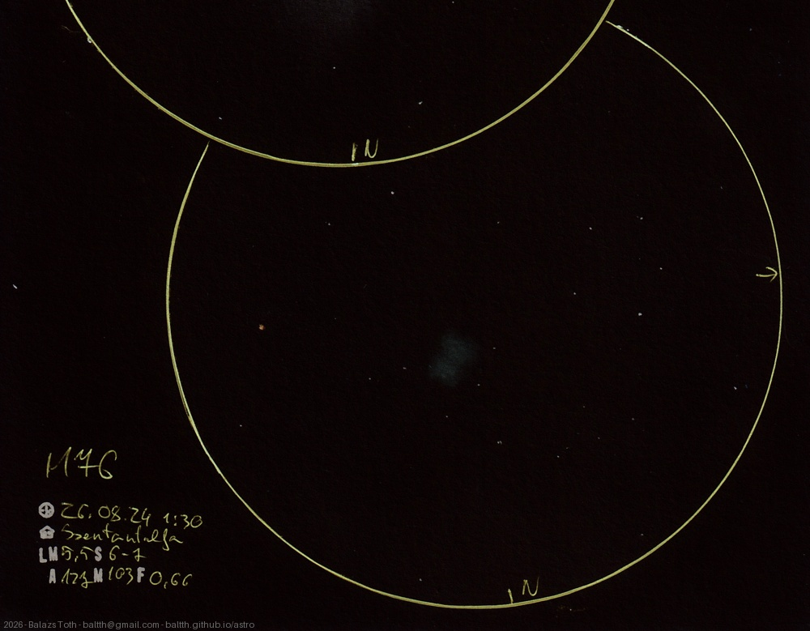

# Messier 76

[Main page](../../index.md) -- [Index](../../pages/obj_index.md)

_M76_ -- _NGC 650_ -- _Little Dumbbell Nebula_ -- _Planetary nebula in Perseus_  

Object | Messier 76
-|-
Observed at | Szent Balázs-hegy, Szentantalfa, HU, 2026-08-24 01:30
NELM | ~ 5.5
Seeing | 6-7
Aperture | 127 mm
Magnification | 103x
FOV | 0.66°

#### Object data

Object | M 76
-|-
Desc. | Planetary nebula †
RA | 01h 42m 00s †
Dec | 51° 34' 48" †

† fetched from [astronomyapi.com](http://astronomyapi.com)

## Links

- [Full sketch](../../img/2026/m33-m76-20260908.jpg)
- [Original sketch](../../scan/2026/20260907004004_001.jpg)
