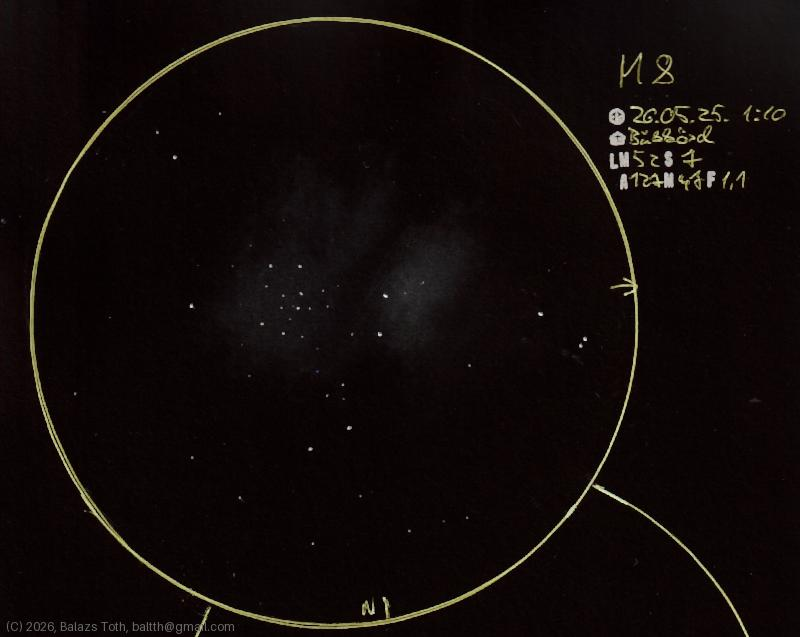

# Messier 8

[Main page](../../index.md) -- [Index](../../pages/obj_index.md)

_M8_ -- _NGC 6523_ -- _Lagoon Nebula_ -- _Emission nebula in Sagittarius_  

Just for fun: my very first astronomy sketch was M8, done into my palm-sized
notebook. [Here](../../img/m8-very-first.jpg) it is.

Object | Messier 8
-|-
Observed at | Bükkösd, HU, 2026-05-25 01:10
NELM | ~ 52
Seeing | 7
Aperture | 127 mm
Magnification | 47x
FOV | 1.1°

#### Object data

Object | M 8
-|-
Desc. | Super nova remnant emission nebula
RA | 18h 03m 35s †
Dec | -24° 23' 24" †

† fetched from [astronomyapi.com](http://astronomyapi.com)

## Links

- [Full sketch](../../img/2026/m8-m22-20260601.jpg)
- [Original sketch](../../scan/2026/20260601011525_001.jpg)
