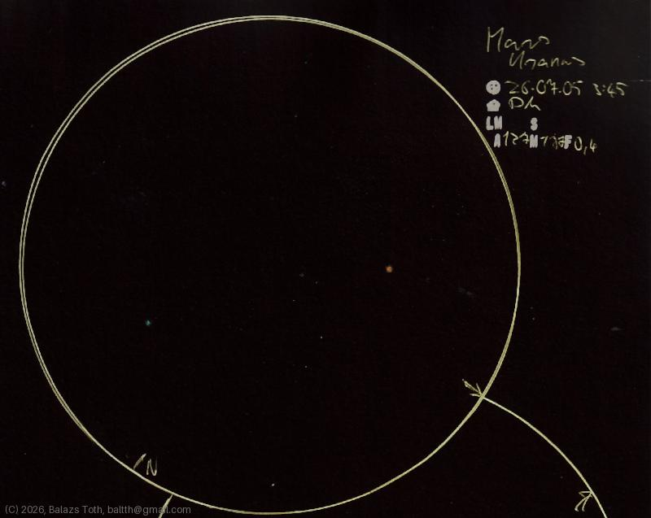

# Mars, Uranus

[Main page](../../index.md) -- [Index](../../pages/obj_index.md)

_Mars_ -- _Planet in Solar System_  
_Uranus_ -- _Planet in Solar System_  

A rare constellation, Mars and Uranus separated by ~10'. As I observed this right before sunrise,
I did not record NELM and seeing as it had no sense. It was fun but not really interesting -
I saw fewer than usual due to the cloudy weather.

> Note that the observation day is off by one compared to the sketch notes.
> I'm sure the correct day id 4th of July as the separation and orientation was
> completely different on the other day. Sorry for this.

Objects | Mars, Uranus
-|-
Observed at | Dunaharaszti, HU, 2026-07-04 03:45
Aperture | 127 mm
Magnification | 171x
FOV | 0.4°

## Links

- [Full sketch](../../img/2026/mars-uranus-m18-20260804.jpg)
- [Original sketch](../../scan/2026/20260804000051_001.jpg)
