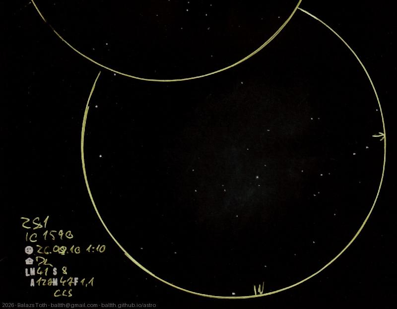

# NGC 281, IC 1590

[Main page](../../index.md) -- [Index](../../pages/obj_index.md)

_IC 11_ -- _Sh2-184_ -- _Pacman Nebula_ -- _Super nova remnant in Cassiopeia_  
_IC 1590_ -- _Open cluster in Cassiopeia_  

Nebulae like this are really challenging from Dunaharaszti. I'd tried this some times before
but this was the first successful observation - as far as I remember this was the first try with CLS.

Just to disambiguate, _NGC 281_ is the _nebula._ _IC 1590_ is the _small cluster in the middle_ of it,
stars on East side do not belong to the cluster.

Pacman looks like an amoeba but definitely has a mouth.

Objects | NGC 281, IC 1590
-|-
Observed at | Dunaharaszti, HU, 2026-08-10 01:10
NELM | ~ 4.1
Seeing | 8
Aperture | 127 mm
Magnification | 47x
FOV | 1.1°
**Other data** |  
Extras | Svbony CLS

#### Object data

Objects | NGC 281 | IC 1590
-|-|-
Desc. | Emission nebula super nova remnant † | Open cluster
RA | 00h 52m 59s † | 00h 52m 49s
Dec | 56° 37' 19" † | 56° 37' 42"

† fetched from [astronomyapi.com](http://astronomyapi.com)

## Links

- [Full sketch](../../img/2026/c16-ngc-281-ic-1590-20260813.jpg)
- [Original sketch](../../scan/2026/20260813073737_001.jpg)
