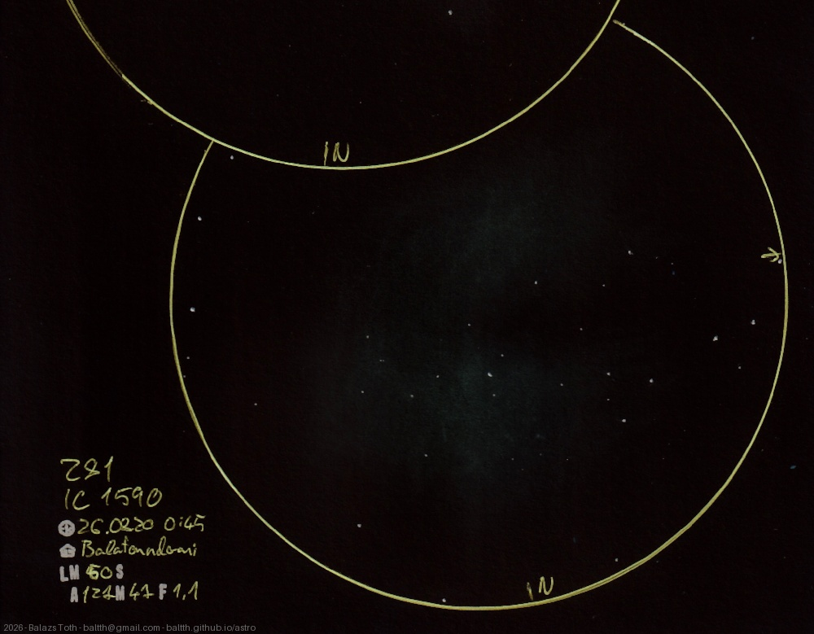

# NGC 281, IC 1590

[Main page](../../index.md) -- [Index](../../pages/obj_index.md) -- [Previous: NGC 281, IC 1590 on 2026-08-09](../../obs/2026/ngc-281-ic-1590-2026-08-09.md)

_IC 11_ -- _Sh2-184_ -- _Pacman Nebula_ -- _Super nova remnant in Cassiopeia_  
_IC 1590_ -- _Open cluster in Cassiopeia_  

Ten days after the [previous sketch](ngc-281-ic-1590-2026-08-09.md)
I've made this as a comparison - much less light pollution, but the seeing is worse.
This time I used no CLS.

Objects | NGC 281, IC 1590
-|-
Observed at | Balatonudvari, HU, 2026-08-20 00:45
NELM | ~ 5.0
Seeing | 5
Aperture | 127 mm
Magnification | 47x
FOV | 1.1°

> Good skies but no good view. I was sitting in garden with a single dark place,
> viewing only Cassiopeia, Andromeda and their close neighborhood.

#### Object data

Objects | NGC 281 | IC 1590
-|-|-
Desc. | Emission nebula super nova remnant † | Open cluster
RA | 00h 52m 59s † | 00h 52m 49s
Dec | 56° 37' 19" † | 56° 37' 42"

† fetched from [astronomyapi.com](http://astronomyapi.com)

## Links

- [Full sketch](../../img/2026/c13-ngc-281-ic-1590-20260907.jpg)
- [Original sketch](../../scan/2026/20260907003841_001.jpg)
- [Previous: NGC 281, IC 1590 on 2026-08-09](../../obs/2026/ngc-281-ic-1590-2026-08-09.md)
