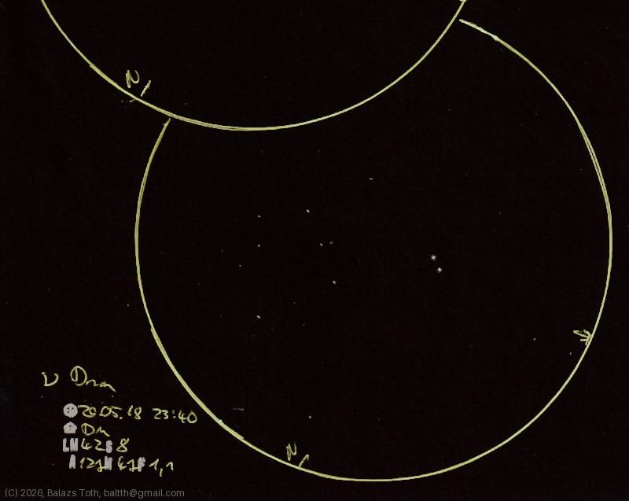

# Nu Draconis

[Main page](../../index.md) -- [Index](../../pages/obj_index.md)

_Nu Dra_ -- _ν Dra_ -- _Kuma_ -- _Star system in Draco_  

Object | Nu Draconis
-|-
Observed at | Dunaharaszti, HU, 2026-05-18 23:40
NELM | ~ 4.2
Seeing | 8
Aperture | 127 mm
Magnification | 47x
FOV | 1.1°

#### Object data

Objects | Nu-1 Draconis | Nu-2 Draconis
-|-|-
Fetched as | HD 159541 | HD 159560
Desc. | 'Am' star on the main sequence | Spectroscopic binary with an 'Am' primary
RA | 17h 32m 10s † | 17h 32m 15s †
Dec | 55° 11' 3" † | 55° 10' 23" †
Magnitude | 4.88 | 4.88
Spectral class | A8Vm (kA3hF0mF0) | A4IVm (kA3hF1mF0)

† fetched from [astronomyapi.com](http://astronomyapi.com)

## Links

- [Full sketch](../../img/2026/c6-nu-dra-20260601.jpg)
- [Original sketch](../../scan/2026/20260601011428_001.jpg)
