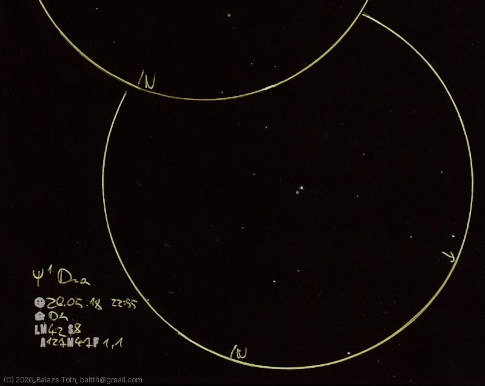

# Psi-1 Draconis

[Main page](../../index.md) -- [Index](../../pages/obj_index.md)

_Psi-1 Dra_ -- _Dziban_ -- _Star system in Draco_  

While it looks like a binary star, Psi-1 Draconis is a triple star system.
Psi-1 Draconis A was found to be a spectroscopic binary on its owm.
Also note that B star has an exoplanet 'Psi-1 Draconis Bb' - imagine it onto the sketch.

Object | Psi-1 Draconis
-|-
Observed at | Dunaharaszti, HU, 2026-05-18 22:55
NELM | ~ 4.2
Seeing | 8
Aperture | 127 mm
Magnification | 47x
FOV | 1.1°

#### Object data

Objects | Psi-1 Dra A | Psi-1 Dra B
-|-|-
Fetched as | HD 162003 | HD 162004
Desc. | Spectroscopic binary star with a main sequence subgiant primary | Yellow main sequence star †
RA | 17h 41m 56s † | 17h 41m 58s †
Dec | 72° 8' 56" † | 72° 9' 25" †
Magnitude | 4.58 | 5.82
Spectral class | F5IV-V † | G0V †

† fetched from [astronomyapi.com](http://astronomyapi.com)

## Links

- [Full sketch](../../img/2026/kemble-2-psi-1-dra-20260601.jpg)
- [Original sketch](../../scan/2026/20260601011218_001.jpg)
