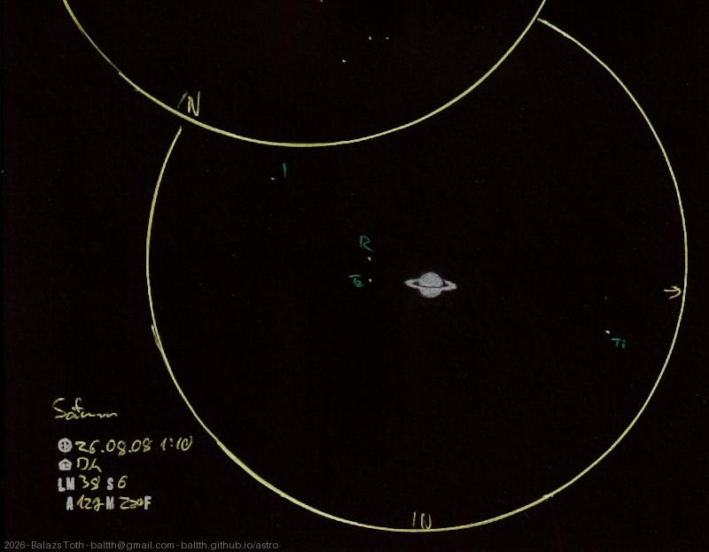

# Saturn

[Main page](../../index.md) -- [Index](../../pages/obj_index.md) -- [Previous: Saturn on 2025-09-11](../../obs/2025/saturn-2025-09-11.md)

_Saturn_ -- _Planet in Solar System_  

The ring of Saturn had turned a lot since the [last time](../2025/saturn-2025-09-11.md) -
it was 11 months ago. I've used higher magnification this time, I was able to observe
four moons, ordered by orbital radius:
- [Tethys](https://en.wikipedia.org/wiki/Tethys_(moon))
- [Rhea](https://en.wikipedia.org/wiki/Rhea_(moon))
- [Titan](https://en.wikipedia.org/wiki/Titan_(moon))
- [Iapetus](https://en.wikipedia.org/wiki/Iapetus_(moon))

> I forgot to note the FOV on the page, sorry for this.

Object | Saturn
-|-
Observed at | Dunaharaszti, HU, 2026-08-08 01:10
NELM | ~ 3.8
Seeing | 6
Aperture | 127 mm
Magnification | 220x
FOV | 0.24°

## Links

- [Full sketch](../../img/2026/c13-saturn-20260813.jpg)
- [Original sketch](../../scan/2026/20260813073147_001.jpg)
- [Previous: Saturn on 2025-09-11](../../obs/2025/saturn-2025-09-11.md)
