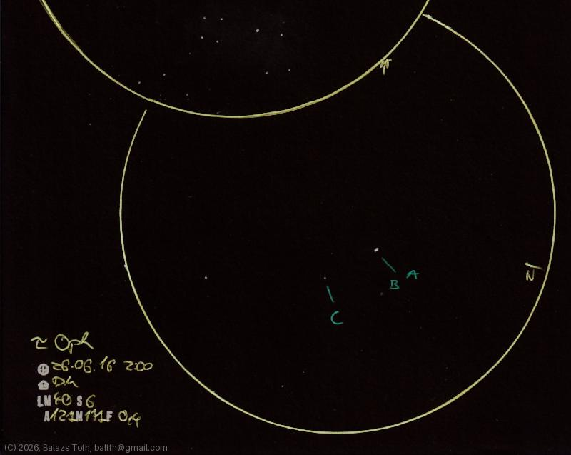

# Tau Ophiuchi

[Main page](../../index.md) -- [Index](../../pages/obj_index.md)

_Tau Oph_ -- _τ Oph_ -- _69 Oph_ -- _BD-08°4549_ -- _Star system in Ophiuchus_  

A quadruple system with close and bright 2+1 stars (A & B) and a far and pale fourth one (C).
I was not able to separate A and B components.

Object | Tau Ophiuchi
-|-
Observed at | Dunaharaszti, HU, 2026-06-16 02:00
NELM | ~ 4.0
Seeing | 6
Aperture | 127 mm
Magnification | 171x
FOV | 0.4°

#### Object data

Objects | Tau Oph A | Tau Oph B | Tau Oph C
-|-|-|-
Fetched as | HD 164764 | HD 164765 | BD-08°4549C
Desc. | Spectroscopic binary star | Main sequence star † | 
RA | 18h 03m 04s † | 18h 03m 04s † | 
Dec | -9° 49' 11" † | -9° 49' 6" † | 
Magnitude | 5.24 | 5.94 | 11.28
Spectral class | F5V+... † | F3J † | 

† fetched from [astronomyapi.com](http://astronomyapi.com)

## Links

- [Full sketch](../../img/2026/c10-tau-oph-20260709.jpg)
- [Original sketch](../../scan/2026/20260709010727_001.jpg)
