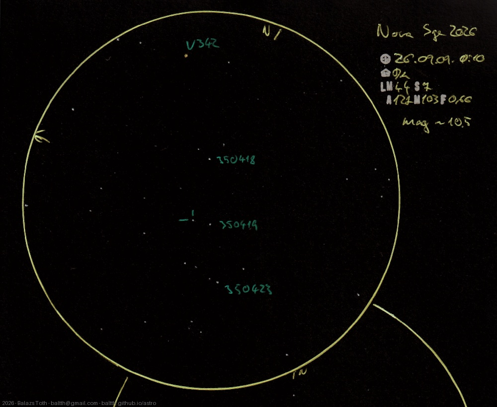

# V488 Sagittae

[Main page](../../index.md) -- [Index](../../pages/obj_index.md)

_V488 Sge_ -- _Nova Sagittae 2026_ -- _Nova in Sagitta_  

Two weeks after the discovery I managed to observe 'Nova Sagittae 2026'.
I guessed its magnitude to 10.5, compared to the surrounding 10.8 to 10.2 stars.
It declines fast as in the first days it was measured between 6-7.

Object | V488 Sagittae
-|-
Observed at | Dunaharaszti, HU, 2026-09-09 00:10
NELM | ~ 4.4
Seeing | 7
Aperture | 127 mm
Magnification | 103x
FOV | 0.66°

#### Object data

Object | V488 Sagittae
-|-
Desc. | Nova
RA | 19h 45m 06.48s
Dec | +18° 22' 42.2"
Magnitude | 10.5

## Links

- [Full sketch](../../img/2026/v488-sge-gamma-del-20260928.jpg)
- [Original sketch](../../scan/2026/20260919015257_001.jpg)
