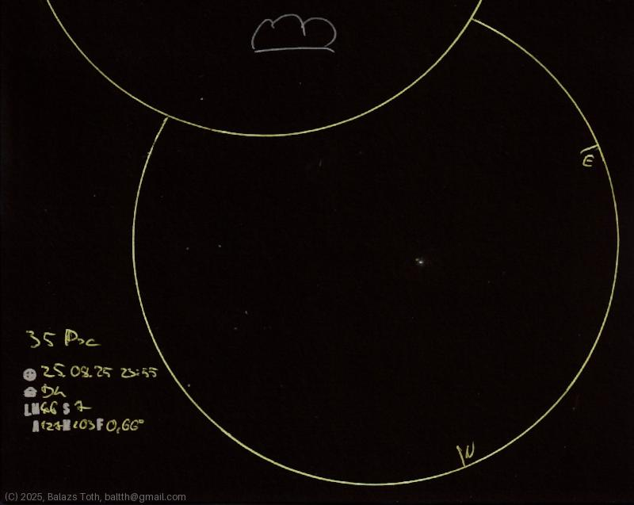

# 35 Piscium

[Main page](../index.md) -- [Index](../pages/obj_index.md)

_35 Psc_ -- _UU Piscium_ -- _Triple star in Pisces_  

This star system looks much prettier than my sketch. The main component is a double star
on its own but it's impossible to resolve with telescope.
It's also a variable star with _UU Psc_ designation.

Unfortunately there's no visible neighbor in this field of view.

Object | 35 Piscium
-|-
Observed at | Dunaharaszti, HU, 2025-08-25 23:55
NELM | ~ 4.6
Seeing | 7
Aperture | 127 mm
Magnification | 103x
FOV | 0.66°

> This is the first try to add some star glow with blending.
> 
> Yes, that's a cloud up there. I've just started to sketch M103 when clouds appeared...

## Links

- [Full sketch](../img/na-35-psc-20250826.jpg)
- [Original sketch](../scan/20250826013407_001.jpg)
