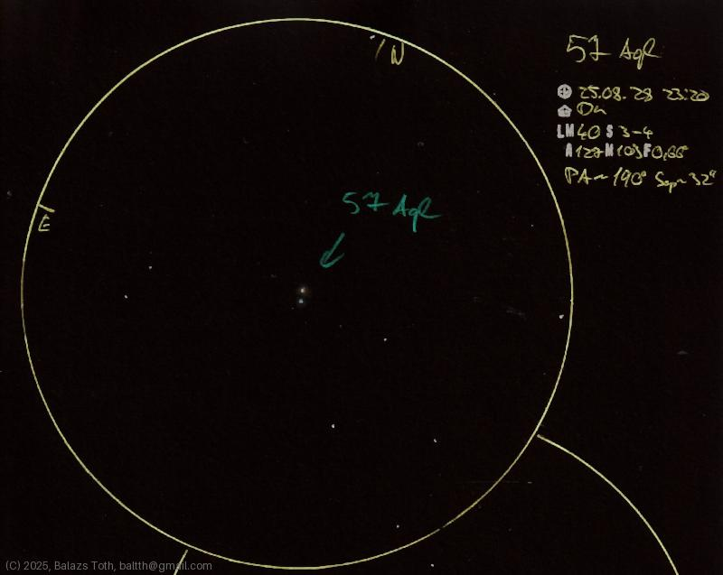

# 57 Aquilae

[Main page](../index.md) - [Index](../pages/obj_index.md)

_57 Aql_ - _Double star in Aquila_  

Object | 57 Aquilae
-|-
Observed at | Dunaharaszti, HU, 2025-08-28 23:20
NELM | ~ 4.0
Seeing | 4
Aperture | 127 mm
Magnification | 103x
FOV | 0.66°
**Other data** |  
PA | ~190°
Separation | 32"

> This night was a 'practice session' for measuring separation of double stars.
> With seeing of 3-4 and clouds coming there was no more to do.

#### Object data

Objects | 57 Aql A | 57 Aql B
-|-|-
Fetched as | HD 188293 | HD 188294
Desc. | Blue main sequence star † | Blue main sequence star †
RA | 19h 54m 37s † | 19h 54m 38s †
Dec | -9° 46' 22" † | -9° 45' 47" †
Magnitude | 5.7 | 6.48
Spectral class | B7Vn † | B8V †

† fetched from [astronomyapi.com](http://astronomyapi.com)

## Links

- [Full sketch](../img/57-aql-iota-cas-20250829.jpg)
- [Original sketch](../scan/20250829153808_002.jpg)
