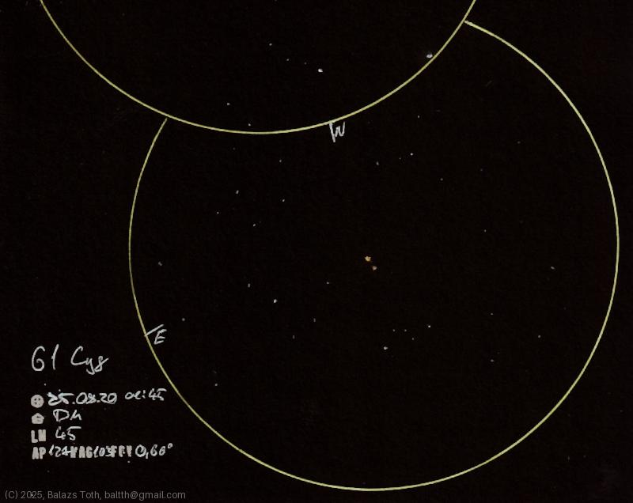

# 61 Cygni

[Main page](../index.md) -- [Index](../pages/obj_index.md)

_61 Cyg_ -- _Double star in Cygnus_  

Really nice binary. This was my fourth sketch on that night.
I was tired, the surroundings may be rough and incomplete.

Object | 61 Cygni
-|-
Observed at | Dunaharaszti, HU, 2025-08-20 01:45
NELM | ~ 4.5
Aperture | 127 mm
Magnification | 103x
FOV | 0.66°

> This night was exceptionally clear, NELM was rather 4.7.
> I was experimenting with using black and blue pens for annotations.

#### Object data

Objects | 61 Cyg A | 61 Cyg B
-|-|-
Fetched as | HD 201091 | HD 201092
Desc. | Main sequence star † | Main sequence star †
RA | 21h 06m 53s † | 21h 06m 54s †
Dec | 38° 44' 58" † | 38° 44' 31" †
Magnitude | 5.2 | 6.0
Spectral class | K5V † | K7V †

† fetched from [astronomyapi.com](http://astronomyapi.com)

## Links

- [Full sketch](../img/m27-61-cyg-20250820.jpg)
- [Original sketch](../scan/20250820_2.jpg)
