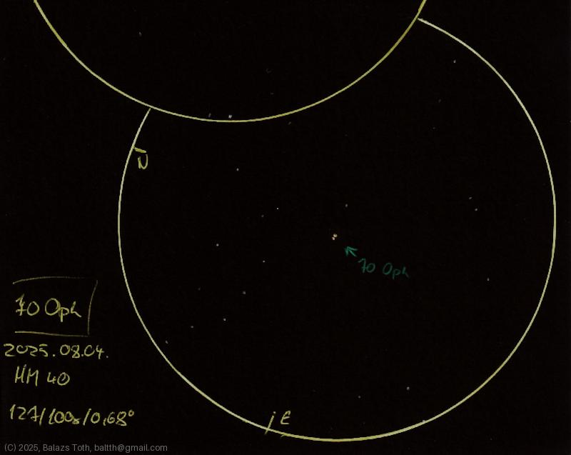

# 70 Ophiuchi

[Main page](../index.md) -- [Index](../pages/obj_index.md)

_70 Oph_ -- _Double star in Ophiuchus_  

Object | 70 Ophiuchi
-|-
Observed at | Dunaharaszti, HU, 2025-08-04
NELM | ~ 4.0
Aperture | 127 mm
Magnification | 100x
FOV | 0.68°

#### Object data

Objects | 70 Oph A | 70 Oph B
-|-|-
Fetched as | HD 165341 | 
Desc. | Main sequence star † | Orange dwarf star
RA | 18h 05m 27s † | 
Dec | 2° 30' 0" † | 
Magnitude | 4.1 | 6.1
Spectral class | K0V SB † | K4

† fetched from [astronomyapi.com](http://astronomyapi.com)

## Links

- [Full sketch](../img/eta-cas-70-oph-20250804.jpg)
- [Original sketch](../scan/20250804.jpg)
