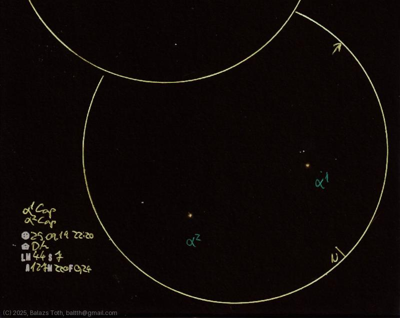

# Alpha-1 Capricorni, Alpha-2 Capricorni

[Main page](../index.md) -- [Index](../pages/obj_index.md)

_Alpha-1 Cap_ -- _Algiedi Prima_ -- _Prima Giedi_ -- _Binary star in Capricornus_  
_Alpha-2 Cap_ -- _Algedi_ -- _Triple star in Capricornus_  

I hoped to be able to resolve BC components of Alpha-2 Cap.
Separated to ~6.6" with 7+ difference in magnitude - well, it's not that easy.
I think I saw _something_ so I added _something_ to the sketch...

Objects | Alpha-1 Capricorni, Alpha-2 Capricorni
-|-
Observed at | Dunaharaszti, HU, 2025-09-19 22:20
NELM | ~ 4.4
Seeing | 7
Aperture | 127 mm
Magnification | 220x
FOV | 0.24°

#### Object data

Objects | Alpha-1 Capricorni | Alpha-2 Cap A | Alpha-2 Cap BC
-|-|-|-
Fetched as | HD 192876 | HD 192947 | 
Desc. | Binary star with a yellow supergiant primary | Yellow star † | Binary star
RA | 20h 17m 38s † | 20h 18m 03s † | 
Dec | -13° 29' 30" † | -13° 27' 19" † | 
Magnitude | 4.27 + 8.6 | 3.57 | ~11
Spectral class | G3Ib † | G6/G8III † | 

† fetched from [astronomyapi.com](http://astronomyapi.com)

## Links

- [Full sketch](../img/c47-alpha-1-cap-alpha-2-cap-20250922.jpg)
- [Original sketch](../scan/20250922010236_001.jpg)
