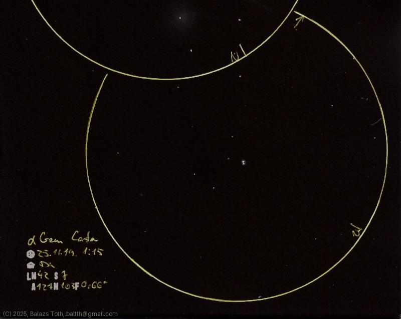

# Alpha Geminorum

[Main page](../index.md) -- [Index](../pages/obj_index.md)

_Alpha Gem_ -- _α Gem_ -- _Castor_ -- _Star system in Gemini_  

Looks like an 'ordinary' double star, but it's a sextuple star system
organized into three binary pairs. It's nice and shiny but
not so interesting on the drawing nor to draw.
I've chosen this star ad-hoc to complete the sketch page
containing [M42 and M43](m42-m43-2025-11-18.md).

Object | Alpha Geminorum
-|-
Observed at | Dunaharaszti, HU, 2025-11-19 01:15
NELM | ~ 4.2
Seeing | 7
Aperture | 127 mm
Magnification | 103x
FOV | 0.66°

#### Object data

Objects | Alpha Gem A | Alpha Gem B | Alpha Gem C
-|-|-|-
Fetched as | HD 60179 | HD 60178 | 
Desc. | Spectroscopic binary | Spectroscopic binary | Spectroscopic binary
RA | 07h 34m 35s † | 07h 34m 36s † | 
Dec | 31° 53' 18" † | 31° 53' 26" † | 
Magnitude | 1.9 | 3.0 | 9.8
Spectral class | A2Vm † | A m † | 

† fetched from [astronomyapi.com](http://astronomyapi.com)

## Links

- [Full sketch](../img/m42-m43-alpha-gem-20251119.jpg)
- [Original sketch](../scan/20251119015731_001.jpg)
