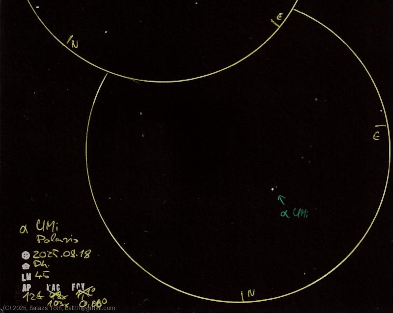

# Alpha Ursae Minoris

[Main page](../index.md) - [Index](../pages/obj_index.md)

_Alpha UMi_ - _α UMi_ - _Polaris_ - _Double star in Ursa Minor_  

Object | Alpha Ursae Minoris
-|-
Observed at | Dunaharaszti, HU, 2025-08-18
NELM | ~ 4.5
Aperture | 127 mm
Magnification | 103x
FOV | 0.66 °

## Links

- [Full sketch](../img/m34-alpha-umi-20250820.jpg)
- [Original sketch](../scan/20250819.jpg)
