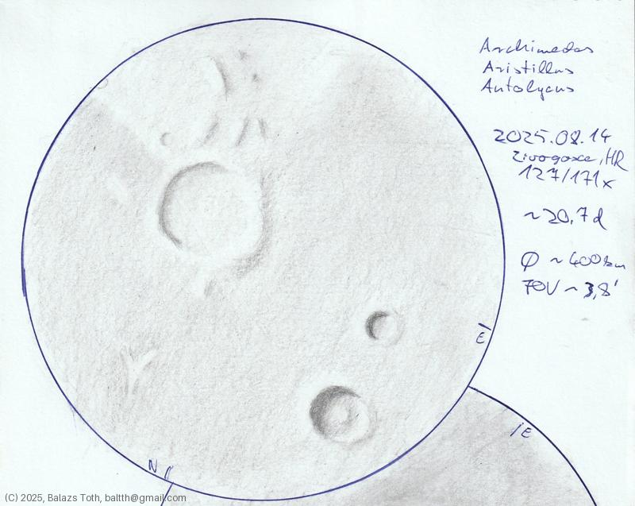

# Archimedes, Aristillus, Autolycus

[Main page](../index.md) -- [Index](../pages/obj_index.md)

_Archimedes_ -- _Crater in Moon_  
_Aristillus_ -- _Crater in Moon_  
_Autolycus_ -- _Crater in Moon_  

First sketch of the Moon.

Objects | Archimedes, Aristillus, Autolycus
-|-
Observed at | Zivogosce, HR, 2025-08-14
Aperture | 127 mm
Magnification | 171x
FOV | 3.8'
**Other data** |  
FOV diameter | ~400 km
Equivalent mag. | ~1070x

## Links

- [Full sketch](../img/archimedes-aristillus-autolycus-aristarchus-herodotus-20250905.jpg)
- [Original sketch](../scan/20250905011040_001.jpg)
