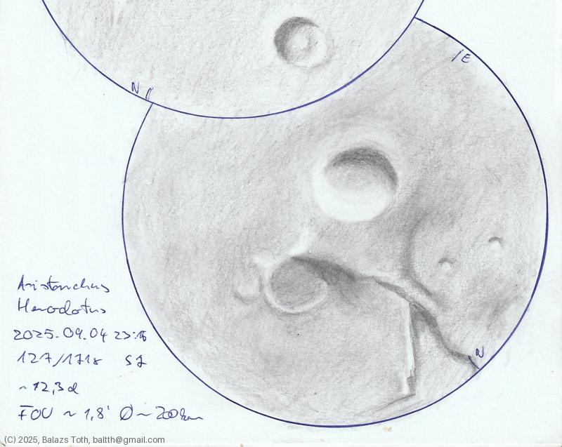

# Aristarchus, Herodotus

[Main page](../index.md) -- [Index](../pages/obj_index.md) -- [Next: Aristarchus, Herodotus on 2025-09-06](../obs/aristarchus-herodotus-2025-09-06.md)

_Aristarchus_ -- _Crater in Moon_  
_Herodotus_ -- _Crater in Moon_  

I wanted to observe the Moon, choosing these craters was an ad-hoc decision.
Aristarchus is considered the brightest on the surface of Moon.
Well, it was bright enough but I only understood this statement when
I checked it again [two days later](aristarchus-herodotus-2025-09-06.md)...

Objects | Aristarchus, Herodotus
-|-
Observed at | Dunaharaszti, HU, 2025-09-04 23:15
Seeing | 7
Aperture | 127 mm
Magnification | 171x
FOV | 1.8'
**Other data** |  
FOV diameter | ~200 km
Equivalent mag. | ~2270x
Age of Moon | 12.3 days

#### Object data

Objects | Aristarchus | Herodotus
-|-|-
Desc. | Crater | Crater
Coordinates | 23.7°N 47.4°W | 23.2°N 49.7°W
Size | 40 km | 35 km

## Links

- [Full sketch](../img/archimedes-aristillus-autolycus-aristarchus-herodotus-20250905.jpg)
- [Original sketch](../scan/20250905011040_001.jpg)
- [Next: Aristarchus, Herodotus on 2025-09-06](../obs/aristarchus-herodotus-2025-09-06.md)
