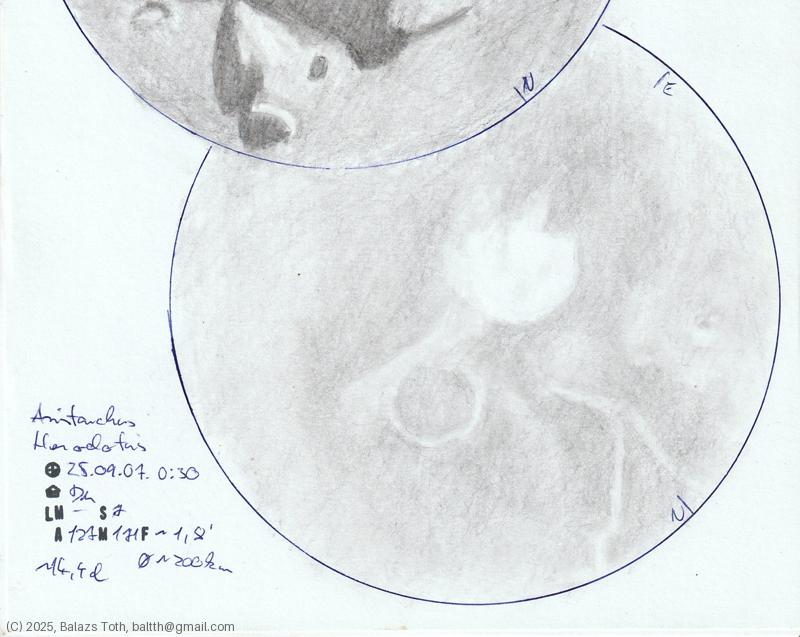

# Aristarchus, Herodotus

[Main page](../index.md) -- [Index](../pages/obj_index.md) -- [Previous: Aristarchus, Herodotus on 2025-09-04](../obs/aristarchus-herodotus-2025-09-04.md)

_Aristarchus_ -- _Crater in Moon_  
_Herodotus_ -- _Crater in Moon_  

Just two days after [sketching these](aristarchus-herodotus-2025-09-04.md)
I checked them again. I was fascinated by the difference
and decided to sketch them again using the same perspective.

Now it's as bright as it can be. Aristarchus had lost its contour and looks
bigger as it's 'merged' with the surrounding light surface.

Objects | Aristarchus, Herodotus
-|-
Observed at | Dunaharaszti, HU, 2025-09-07 00:30
Seeing | 7
Aperture | 127 mm
Magnification | 171x
FOV | 1.8'
**Other data** |  
FOV diameter | ~200 km
Equivalent mag. | ~2270x
Age of Moon | 14.4 days

#### Object data

Objects | Aristarchus | Herodotus
-|-|-
Desc. | Crater | Crater
Coordinates | 23.7°N 47.4°W | 23.2°N 49.7°W
Size | 40 km | 35 km

## Links

- [Full sketch](../img/fracastorius-aristarchus-herodotus-20250912.jpg)
- [Original sketch](../scan/20250912075516_001.jpg)
- [Previous: Aristarchus, Herodotus on 2025-09-04](../obs/aristarchus-herodotus-2025-09-04.md)
